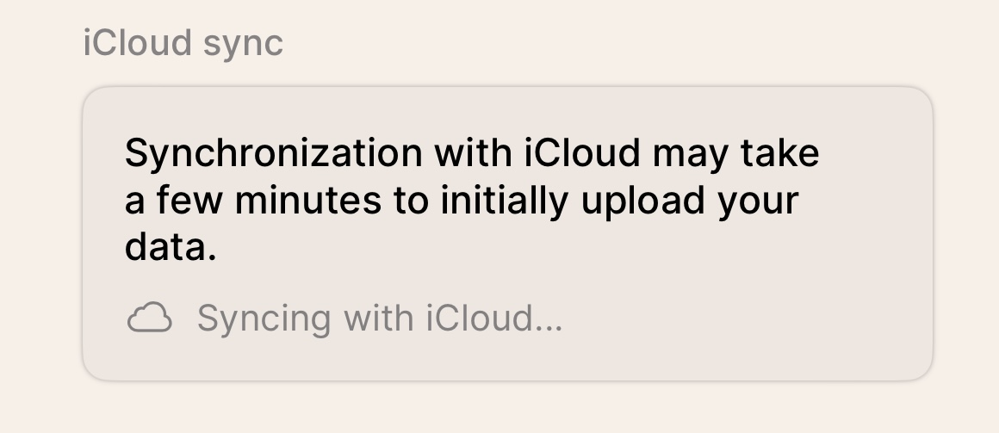
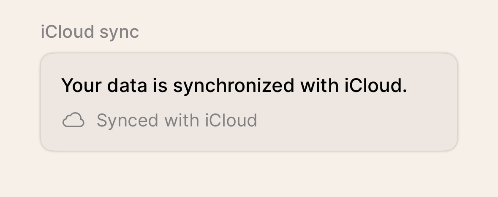

# iCloud Sync Status View for SwiftUI

This component provides an elegant and functional view to display the iCloud synchronization status in iOS applications using SwiftData or CoreData with iCloud sync.

## Features

- Displays the current sync status (Unknown, Syncing, Synced, Error)
- Automatically updates based on `NSPersistentCloudKitContainer` notifications
- Modern and easily customizable design
- SwiftUI compatible
- Works with both SwiftData and CoreData

## Installation

1. Add the `CloudSyncStatusView.swift` file to your Xcode project.
2. Ensure your project has iCloud and CloudKit capabilities enabled.

## Usage

```swift
import SwiftUI

struct ContentView: View {
    @StateObject private var cloudKitSyncMonitor = CloudKitSyncMonitor()
    
    var body: some View {
        VStack {
            CloudSyncStatusView(syncMonitor: cloudKitSyncMonitor)
        }
    }
}
```

## Customization

You can easily customize the appearance of the view by modifying the styles in the `CloudSyncStatusView` struct.

## View
iCloud Syncing Status
<br>

<br><br>
iCloud Sync Status
<br>


## Contributions

Contributions are welcome. Please open an issue or submit a pull request to suggest changes or improvements.
